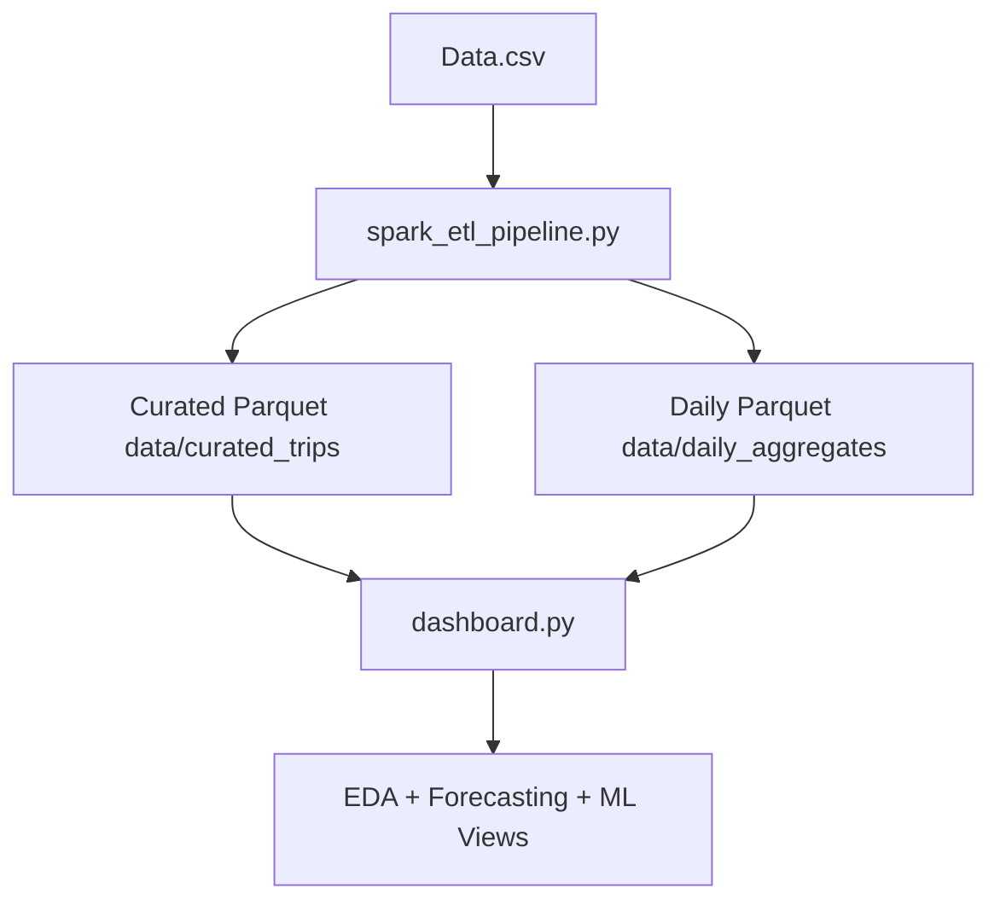

# Uber Trip Analysis - Data Engineering + Dashboard Project

This is my end-to-end Uber trip analytics project where I built a small data engineering pipeline using PySpark and Parquet, then connected it to a Streamlit dashboard for analysis and forecasting.

I started from raw CSV data and structured the project so I can re-run the pipeline anytime and keep the dashboard fast by reading curated parquet files.

## What I Built

- PySpark ETL pipeline to clean and transform raw trip data
- Parquet-based curated layer partitioned by date
- Daily aggregate parquet dataset for fast trend analysis
- Streamlit dashboard for EDA, ML models, and forecasting
- Windows-friendly pipeline execution scripts

## Current Tech Stack

- Python
- PySpark
- PyArrow + Pandas
- Streamlit
- Scikit-learn
- TensorFlow/Keras
- Prophet

## Data Pipeline Flow

I designed the pipeline like this:

```text
Data.csv
  -> Spark read (schema checks + required columns)
  -> Data cleaning and feature engineering
	  - START_DATE/END_DATE parsing
	  - MILES casting
	  - Duration(min), Date, Hour, Weekday
	  - PURPOSE null handling (Unknown)
  -> Curated output (parquet, partitioned by Date)
	  path: data/curated_trips
  -> Daily aggregates (trip_count, total_miles, avg_duration_min)
	  path: data/daily_aggregates
  -> Streamlit dashboard loads curated parquet (preferred)
	  fallback: CSV if parquet is unavailable
```

## Pipeline Runtime Flow



## Project Structure

```text
Uber-Trip-Analysis/
  dashboard.py
  spark_etl_pipeline.py
  run_pipeline.bat
  run_pipeline.ps1
  Data.csv
  data/
	 curated_trips/
	 daily_aggregates/
  requirements.txt
  README.md
```

## Setup

```bash
git clone <your-repo-url>
cd Uber-Trip-Analysis
python -m venv venv
```

Windows PowerShell:

```powershell
& .\venv\Scripts\Activate.ps1
pip install -r requirements.txt
```

Git Bash:

```bash
source venv/Scripts/activate
pip install -r requirements.txt
```

## Run ETL Pipeline

Option 1 (direct command):

```bash
python spark_etl_pipeline.py --input Data.csv --output data
```

Option 2 (scripted):

PowerShell:

```powershell
.\run_pipeline.ps1
```

CMD:

```bat
run_pipeline.bat
```

## Run Dashboard

```bash
streamlit run dashboard.py
```

In the sidebar, I keep these values:

- CSV path: `Data.csv`
- Curated parquet path: `data/curated_trips`
- Prefer curated parquet if available: checked

## How I Verify Parquet Is Being Used

Inside the dashboard sidebar, I check:

- `Data source in use: parquet`

If it shows `csv`, I re-run ETL and restart Streamlit.

## Notes About Windows Compatibility

The ETL script first tries Spark native parquet writes. If Windows Hadoop binaries are not available, it falls back to a PyArrow write path so the pipeline still succeeds and parquet remains usable.

## Contact

Sahil Bhalekar

